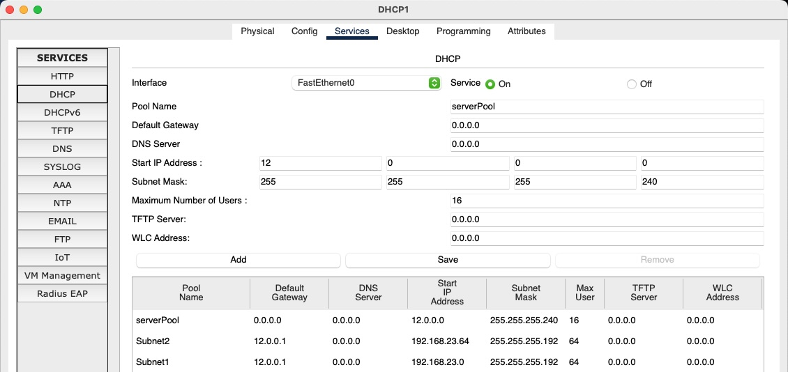

# Proyecto 1

Topología para la primera práctica de Redes de Computadoras 2 del 2do Semestre de 2024

## Requisitos

Para correr la práctica se de contar con los siguientes requisitos:

- Cisco Packet Tracer 8.2.2.0400 [Aquí](https://www.netacad.com/portal/resources/packet-tracer)

## Integrantes

| Carnet      | Nombre                                 | 
|-------------|----------------------------------------|
|  201114340  |  Edgar Mauricio Gómez Flores           |
|  201020232  |  Daniel Eduardo Mellado Ayala          |
|  201900822  |  Osmar Noel Chacón Lemus               |

## Configuración

A continuación se describen los pasos realizados para configurar la práctica:

## Índice
1. [Configurar servidores DHCP](#configurar-servidores-dhcp)
2. [Configurar VLAN Trunking Protocol](#configurar-vlan-trunking-protocol)
3. [Configurar enlaces truncales](#configurar-enlaces-truncales)
4. [Configurar VLANs](#configurar-vlans)
4. [Configurar dispositivos finales](#configurar-dispositivos-finales)
5. [Configurar LACP](#configurar-servidores-dhcp)
6. [Configurar EIGRP](#configurar-eigrp)

### Configurar servidores DHCP

#### Servidor 1 y 2

1. Seleccionar Servidor e ir a la pestaña de "Desktop"


2. Seleccionar "IP Configuration" para ingresar valores

| IP Address     | Subnet Mask     | DNS Server | Default Gateway |
| 192.168.23.1   | 255.255.255.192 | 0.0.0.0    | 192.168.23.1    |
| 192.168.23.129 | 255.255.255.192 | 0.0.0.0    | 192.168.23.129  |


3. Habilitar servicio DHCP moviendose a la pestaña de "Services" y seleccionando "DHCP" del menu lateral izquierdo. Los valores de cada servidor se indican en las siguientes tablas:



| Pool Name  | Default gateway & DNS Server | Start IP Address | Subnet Mask     | Max User |
| serverPool | 192.168.23.1                 | 192.168.23.0     | 255.255.255.192 | 64       |
| Subnet1    | 192.168.23.1                 | 192.168.23.4     | 255.255.255.192 | 60       |
| Subnet2    | 192.168.23.1                 | 192.168.23.66    | 255.255.255.192 | 62       |

| Pool Name  | Default gateway & DNS Server | Start IP Address | Subnet Mask     | Max User |
| serverPool | 192.168.23.129               | 192.168.23.128   | 255.255.255.192 | 64       |
| Subnet3    | 192.168.23.129               | 192.168.23.132   | 255.255.255.192 | 60       |
| Subnet4    | 192.168.23.129               | 192.168.23.194   | 255.255.255.192 | 62       |

### Configurar VLAN Trunking Protocol

Para evitar crear las VLAN en todos los MultiLayer Switch y Switch Layer 2, se utiliza el protocolo VLAN Trunking Protocol (VTP), se escoge el MultiLayer Switch 0 (MLS0) como servidor y el resto se configuran en modo cliente.

#### MLS0

```bash
Switch>en
Switch#conf t
Switch(config)#hostname MLS0

MLS0(config)#vtp mode server
MLS0(config)#vtp domain usac.g23
MLS0(config)#vtp password g23
```

#### MLS1 al MLS11 y S0 al S3

```bash
Switch>en
Switch#conf t
Switch(config)#hostname [MLS<1-11>] / [S<0-3>]

MLS1(config)#vtp mode client
MLS1(config)#vtp domain usac.g23
MLS1(config)#vtp password g23
```

### Configurar enlaces truncales

Para permitir la propagación de la información de las VLAN por todos los Switches en el dominio, se necesita configurar los puertos en modo truncal entre ellos.

| Switch | Rango interfaces           |
| MLS0   | g1/1/1-2                   |
| MLS1   | g1/0/1-3 (LACP) y g1/1/1-3 |
| MLS2   | g1/0/1-3 (LACP) y g1/1/1-3 |
| MLS3   | f0/1-5 (1-3 LACP)          |
| MLS4   | f0/4-5                     |
| MLS5   | f0/5-6                     |
| MLS6   | f0/5-6 y f0/10-11          |
| MLS7   | f0/1-5 (1-3 LACP)          |
| MLS8   | f0/4-5                     |
| MLS9   | f0/5-6                     |
| MLS10  | f0/5-6 y f0/10-11          |
| MLS11  | g1/1/1-2                   |

```bash
MLS0(config)#int range <insertar rango>
MLS0(config)#switchport trunk encapsulation dot1q // Solo para interfaces FastEthernet conectando a Switch Layer 2 no MultiLayer Switch
MLS0(config-if-range)#switchport mode trunk
MLS0(config-if-range)#switchport trunk allowed vlan 10,20
```

### Configurar VLANs

Una vez configurados los enlaces truncales, procedemos a crear las VLAN en el Switch Servidor

| VLAN | Nombre                |
| 10   | VLAN_Naranja_Grupo_23 |
| 20   | VLAN_Verde_Grupo_23   |

#### MLS0

```bash
MLS0(config)#vlan <insertar numero>
MLS0(config-vlan)#name <insertar nombre>
```

### Configurar dispositivos finales

Luego de crear las VLANs, podemos continuar a configurar los interfaces que conectan con los dispositivos finales en modo acceso con su correspondiente VLAN.

| Switch | Rango de interfaz | VLAN asignada |
| S0     | f0/11-12          | 10 (Naranja)  |
| S1     | f0/11-12          | 20 (Verde)    |
| S2     | f0/11-12          | 20 (Verde)    |
| S3     | f0/11-12          | 10 (Naranja)  |

```bash
S0(config)#int range <insertar rango>
S0(config-if)#switchport mode access
S0(config-if)#switchport access vlan <insert vlan>
```

### Configurar LACP

| Switch | Rango de interfaz | IP Address     | Subnet Mask     |
| MLS1   | g1/0/1-3          | 192.168.23.2   | 255.255.255.192 |
| MLS3   | f0/1-3            | 192.168.23.3   | 255.255.255.192 |
| MLS2   | g1/0/1-3          | 192.168.23.130 | 255.255.255.192 |
| MLS7   | f0/1-3            | 192.168.23.131 | 255.255.255.192 |

```bash
MLS1(config)#int range <insertar rango>
MLS1(config-if-range)#no switchport
MLS1(config-if-range)#channel-group 1 mode active
MLS1(config-if-range)#channel-protocol lacp
MLS1(config-if-range)#interface Port-channel1
MLS1(config-if)#ip address <insertar ip> 255.255.255.192
```

### Habilitar Inter-VLAN en Switch MultiLayer

#### M2, T3, T9 y Biblioteca Central
```bash
MLSM2(config)#ip routing
MLSM2(config)#do write
```

### Configurar Interfaces VLAN en Switch MultiLayer


### Configurar EIGRP

#### MLS0

```bash
MLSM2(config)#router eigrp 23
MLSM2(config-router)#network 11.0.0.2 0.0.0.255
MLSM2(config-router)#passive-interface f0/1
MLSM2(config-router)#no auto-summary
MLSM2(config-router)#end
```

#### Multilayer Switch 2

```bash
MLST3(config)#router eigrp 23
MLST3(config-router)#network 11.0.0.3 0.0.0.255
MLST3(config-router)#network 12.0.0.3 0.0.0.255
MLST3(config-router)#network 13.0.0.3 0.0.0.255
MLST3(config-router)#passive-interface f0/1
MLST3(config-router)#no auto-summary
MLST3(config-router)#end
```

#### Multilayer Switch 3

```bash
MLST9(config)#router eigrp 23
MLST9(config-router)#network 12.0.0.3 0.0.0.255
MLST9(config-router)#passive-interface f0/1
MLST9(config-router)#no auto-summary
MLST9(config-router)#end
```

#### Multilayer Switch 0

```bash
MLSBCENTRAL(config)#router eigrp 23
MLSBCENTRAL(config-router)#network 13.0.0.3 0.0.0.255
MLSBCENTRAL(config-router)#passive-interface f0/1
MLSBCENTRAL(config-router)#no auto-summary
MLSBCENTRAL(config-router)#end
```

#### Verificar el Routing EIGRP

```bash
MLSBCENTRAL#show ip eigrp neighbors
MLSBCENTRAL#show ip protocols
```
