# Práctica 1

Topología para la primera práctica de Redes de Computadoras 2 del 2do Semestre de 2024

## Requisitos

Para correr la práctica se de contar con los siguientes requisitos:

- Cisco Packet Tracer 8.2.2.0400 [Aquí](https://www.netacad.com/portal/resources/packet-tracer)

## Integrantes

| Carnet      | Nombre                                 | 
|-------------|----------------------------------------|
|  201114340  |  Edgar Mauricio Gómez Flores           |
|  201020232  |  Daniel Eduardo Mellado Ayala          |
|  201900822  |  Osmar Noel Chacón Lemus               |


## Configuración

A continuación se describen los pasos realizados para configurar la práctica:

### 1. Dispositivos finales - Direcciones IP

1.1 Seleccionar dispositivo final (PC o Laptop) y seleccionar pestaña de "Desktop"

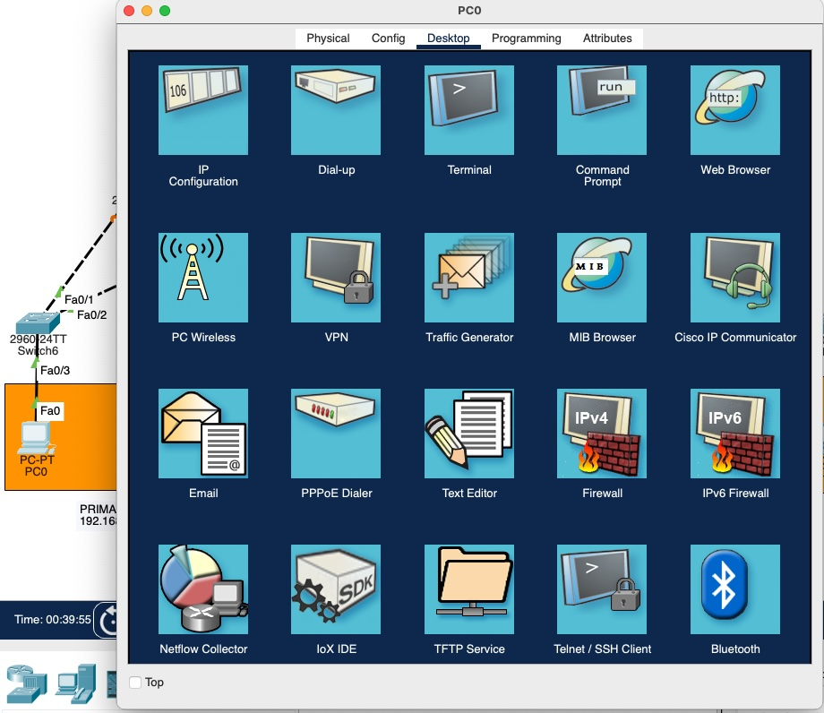

1.2 En las opciones disponibles, seleccionar "IP Configuration"

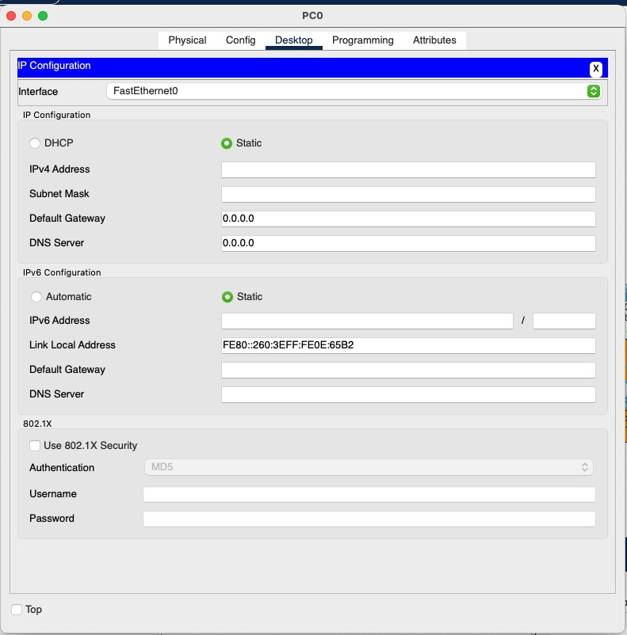

1.3 Asignar dirección IP, máscara de subred y puerta de enlace predeterminada

| IP Address | Subnet Mask | Default Gateway |
| --- | --- | --- |
| 192.168.vv.yy | 255.255.255.0 | 192.168.vv.1 |

Donde:

- vv: Número de VLAN (15, 25, 35)
- yy: Número de dispositivo en el rango 2 a 254

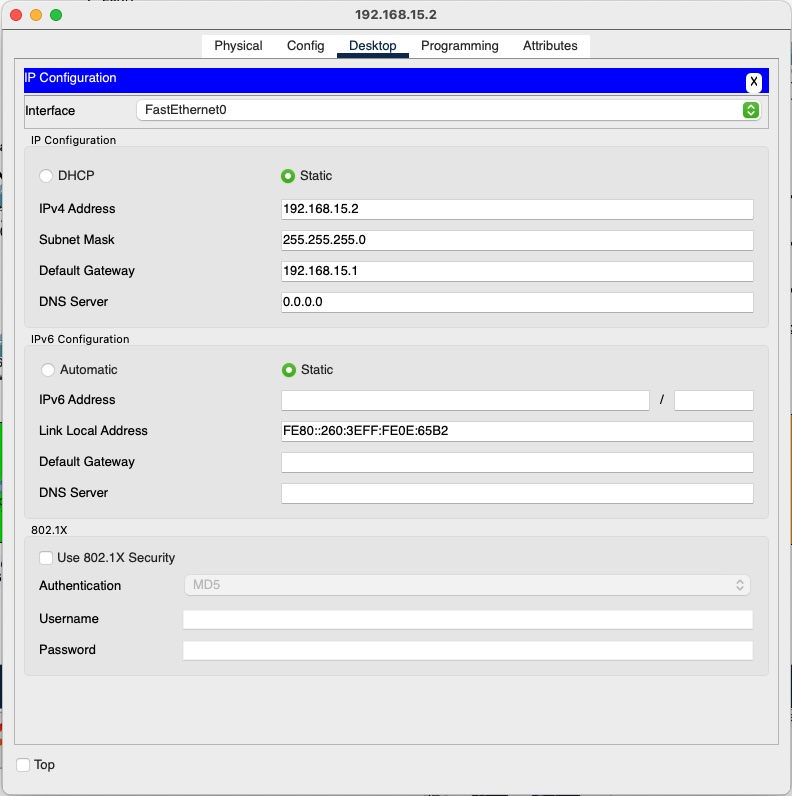

### 2. Switches - Hostname

2.1 Seleccionar Switch y moverse a la pestaña "CLI" (Command Line Interface)

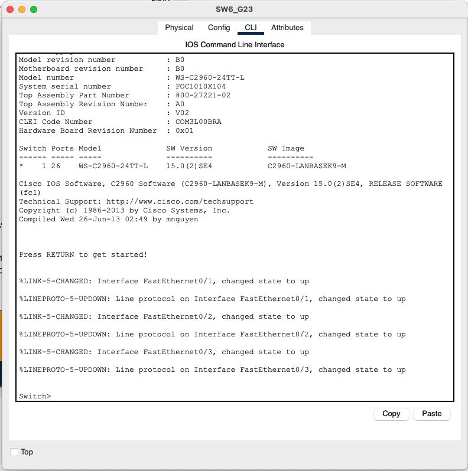

2.2 Cambiar hostname

Cada Switch dentro de la topología tiene un hostname específico, se asigna con los siguientes comandos

```bash
$ enable
$ configure terminal
$ hostname SWx_G23
$ do write # Guardar configuración
```

Donde:

- x: Número de Switch dentro de la topología

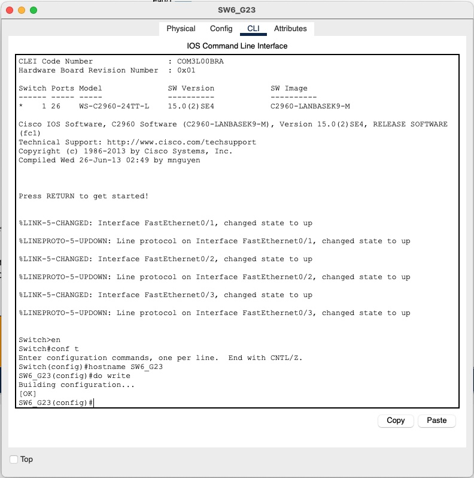

### 3. Switches - Contraseña

3.1 Habilitar contraseña al momento de conectarse al equipo

```bash
$ enable
$ configure terminal
$ enable secret g23
$ do write # Guardar configuración
```

### 4. Switches - Configurar VTP servidor y clientes

4.1 Se escoge el Switch SW0_G23 como el único switch que se quedará en modo Servidor

```bash
$ enable
$ configure terminal
$ vtp mode server
$ vtp version 2 # Para configurar contraseña
$ vtp domain practica1.usac
$ vtp password g23
$ do write
```

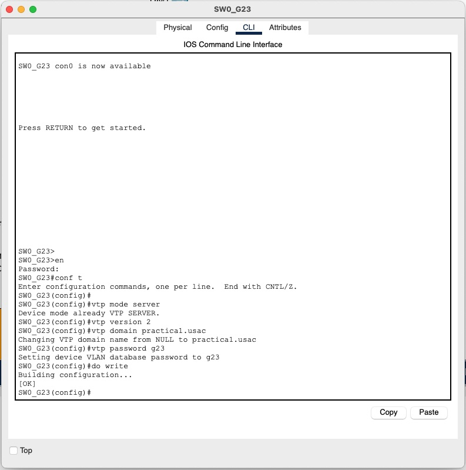

El resto de Switches se configurarán en modo cliente

4.2 Se escoge el Switch SW0_G23 como el único switch que se quedará en modo Servidor

```bash
$ enable
$ configure terminal
$ vtp version 2 # Para configurar contraseña
$ vtp mode client
$ vtp domain practica1.usac
$ vtp password g23
$ do write
```

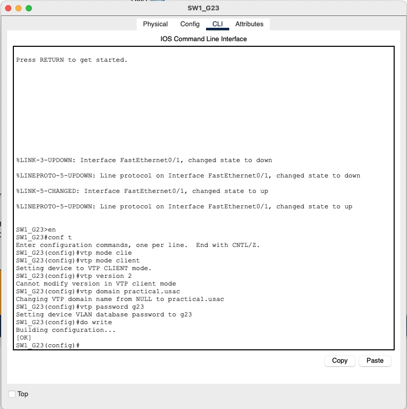

### 5. Switche Servidor - Crear VLAN

5.1 Crear VLAN's en Switch Servidor para luego proceder con la configuración de interfaces

```bash
$ enable
$ configure terminal
$ vlan 15/25/35
$ name PRIMARIA/BASICOS/DIVERSIFICADO
```
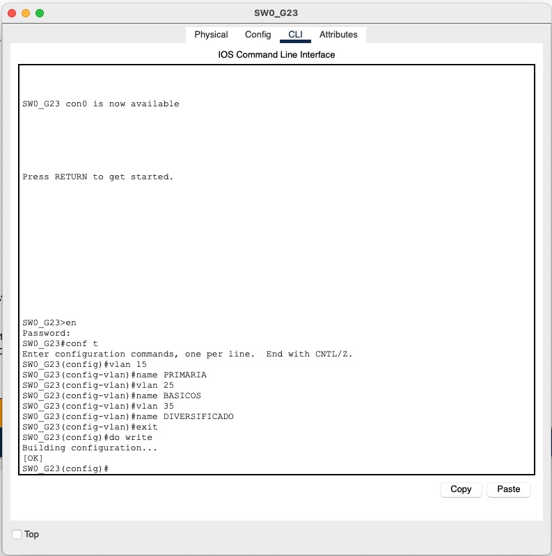

## Configuración de Acceso

```bash
interface range f0/1-3
switchport mode access
switchpor access vlan 15
```

## Configuración de STP

### Configurar PVST en cada VLAN

```bash
spanning-tree vlan 15
spanning-tree vlan 25
spanning-tree vlan 35
```

### Verificación de switch raíz para cada VLAN

```bash
show spanning-tree vlan 15
show spanning-tree vlan 25
show spanning-tree vlan 35
```

### Cambio de prioridad del switch para hacerlo root

```bash
spanning-tree vlan 15 root primary
spanning-tree vlan 25 root primary
spanning-tree vlan 35 root primary
```

## Configuración del Rapid PVST

### Cambio del modo PVST a Rapid PVST

```bash
spanning-tree mode rapid-pvst
spanning-tree vlan 15
spanning-tree vlan 25
spanning-tree vlan 35
```

### Verificación de la configuración

```bash
show spanning-tree vlan 15
show spanning-tree vlan 25
show spanning-tree vlan 35
```

## Pruebas y Comparación de Convergencia

### Verificación del estado del spanning tree

```bash
show spanning-tree
```

### Verificación de tiempos de BPDU

```bash
show spanning-tree detail
```

Al final, Rapid PVST generalmente ofrece mejor convergencia, pero se han probado ambos para ver las diferencias en el comportamiento de la red.

## Seguridad de interfaces de red

### Politicas de puerto compartidas

Para poder desactivar el protocolo DTP de todos los puertos de los dispositivos se utilizaron los comandos:
```bash
interface range f0/1-3
switchport mode trunk
switchport nonegotiate
exit
```
El rango varía segun las interfaces que se tengan conectadas por cada switch

### Activación de Port-Security

Ya que se hicieron estas configuraciones, ahora se tomará una lista de los dispositivos MAC para poder activar el port security en los switches que conectan con estos dispositivos finales

```bash
0060.3E0E.65B2
0060.47B2.0434
00D0.973A.3B72
0040.0B46.9926
0060.2F90.A968
0001.64CA.DA16
0060.2F86.EC7B
0001.63E1.884C
0010.11CE.2411
0030.A39D.DD29

interface fa0/3
switchport mode access
switchport port-security
switchport port-security mac-address 0060.3E0E.65B2

interface fa0/3
switchport mode access
switchport port-security
switchport port-security mac-address 0060.47B2.0434

interface fa0/2
switchport mode access
switchport port-security
switchport port-security mac-address 00D0.973A.3B72

interface fa0/3
switchport mode access
switchport port-security
switchport port-security mac-address 0040.0B46.9926

interface fa0/3
switchport mode access
switchport port-security
switchport port-security mac-address 0060.2F90.A968

interface fa0/3
switchport mode access
switchport port-security
switchport port-security mac-address 0001.64CA.DA16

interface fa0/3
switchport mode access
switchport port-security
switchport port-security mac-address 0060.2F86.EC7B

interface fa0/2
switchport mode access
switchport port-security
switchport port-security mac-address 0001.63E1.884C

interface fa0/3
switchport mode access
switchport port-security
switchport port-security mac-address 0010.11CE.2411

interface fa0/3
switchport mode access
switchport port-security
switchport port-security mac-address 0030.A39D.DD29

```


### Elección de escenario con mejor resultado de convergencia

| Escenario | Protocolo Spanning-Tree | Red Primaria | Red Básicos | Red Diversificado |
|-----------|-------------------------|--------------|-------------|-------------------|
| 1         | PVST                    |      65      |      37     |         62        |
| 2         | Rapid PVST              |      1       |      1      |         0         |

### Pruebas de Conexión con PVST

Para la primer  prueba se hace un ping extendido de PVST, por la red Primaria se hace una conexión, se deshabilita la intefaz de un switch SW4 para ser exactos, donde este rehabilita la conexión con la red en un tiempo de 65 segundos aproximadamente.
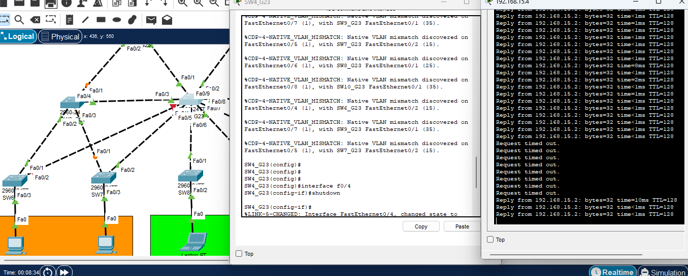


Para la segunda prueba se hace un ping extendido de PVST, por la red Básicos se hace una conexión, se deshabilita la intefaz de un switch SW0(servidor) para ser exactos, donde este rehabilita la conexión con la red en un tiempo de 37 segundos aproximadamente para conectarse con los otros dispositivos de la red.
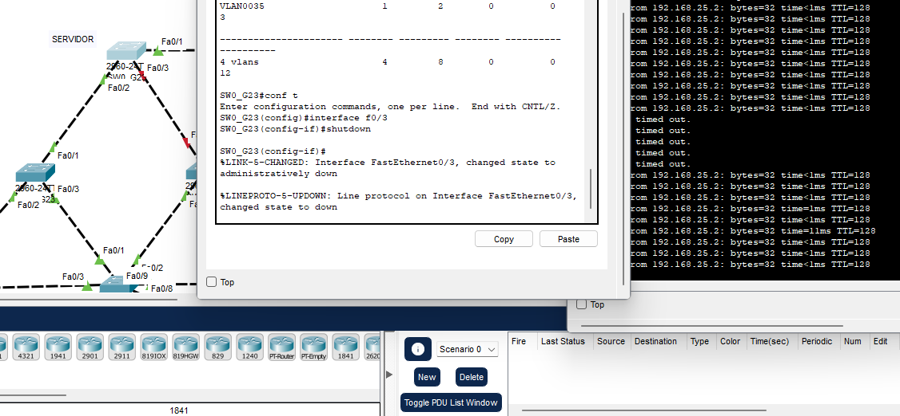

Para la tercera prueba se hace un ping extendido de PVST, por la red Diversificado se hace una conexión, se deshabilita la intefaz de un switch SW2 para ser exactos, donde este rehabilita la conexión con la red en un tiempo de 62 segundos aproximadamente para conectarse con los otros dispositivos de la red.

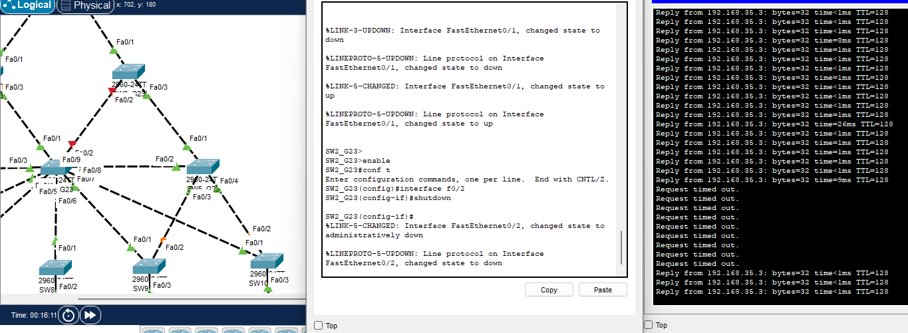

### Pruebas de Conexión con Rapid PVST

Para las pruebas se hizó un ping  extendido de la Red primaria la primer computadora a la otra red primaria de la primer computadora, se apagó un switch el 15 para ser exactos la interface que conecta con el switch que le da entrada al  ping.

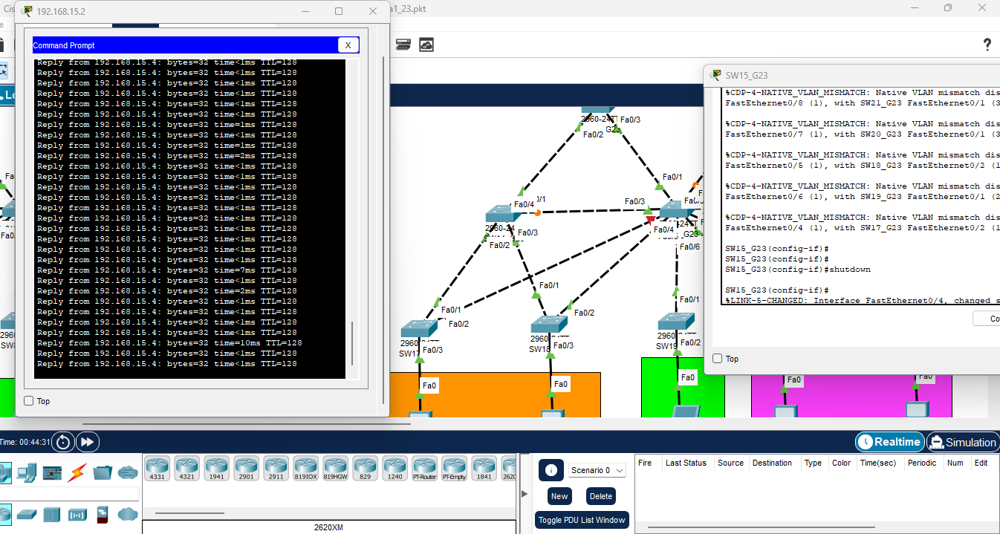

Al volver a encender la interface, el ping tardó  un segundo en volver a encontrar el camino de conexión.

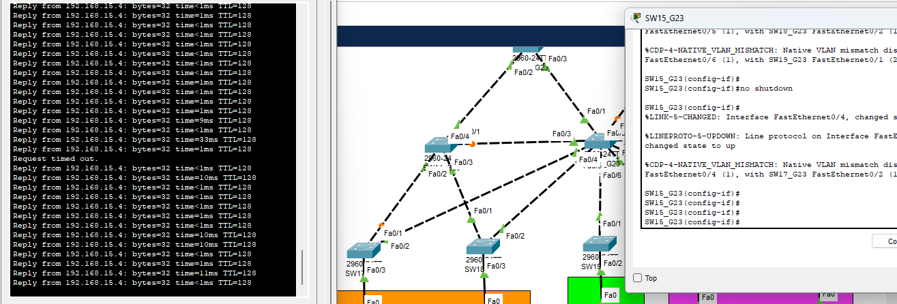

Se hizó un ping  extendido de la Red de Basicos con la primer computadora a la otra red Basicos de la primer computadora, se apagó un switch el 12 para ser exactos la interface que conecta con el switch que le da entrada al  ping. En esta tambien tarda un segundo en volver la conexión.
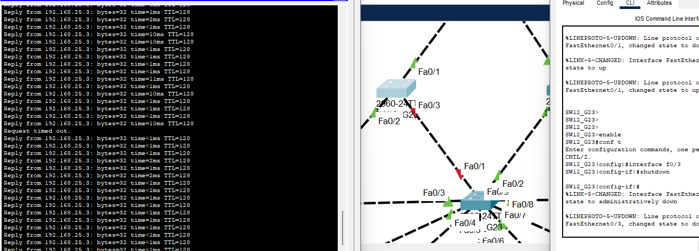

Se hizó un ping  extendido de la Red de Diversificado con la primer computadora a la otra red Diversificado de la primer computadora, se apagó un switch el 16 para ser exactos la interface que conecta con el switch que le da entrada al  ping.

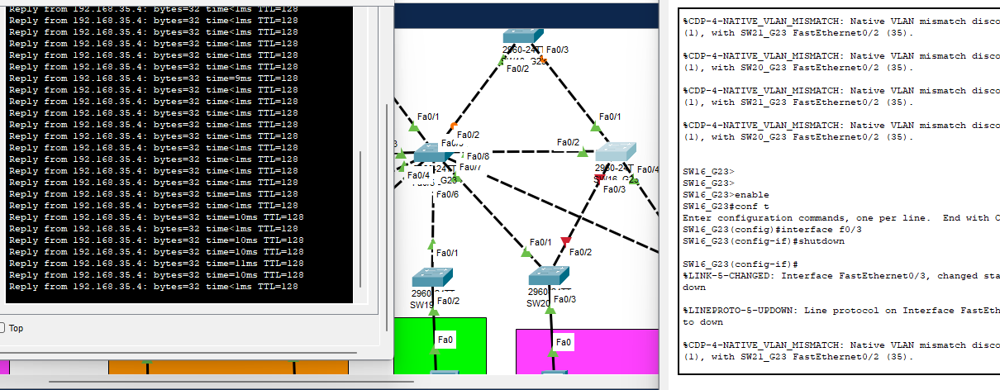


Se hizó un ping  extendido de la Red de Diversificado con la primer computadora a la otra red Diversificado de la primer computadora, se apagó un switch el 4 para ser exactos la interface que conecta con el switch que le da entrada al  ping.
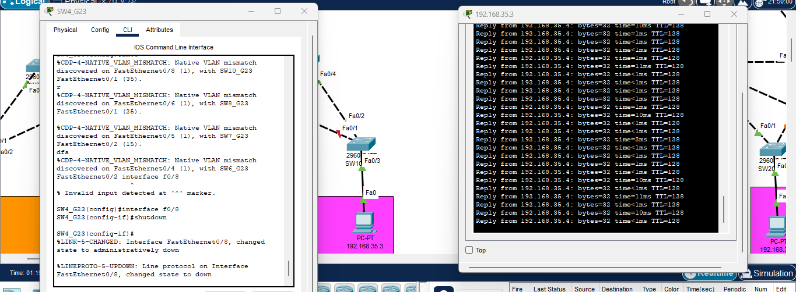


## Conclusiones de la red

Para escoger la mejor configuración de red, se analizan los tiempos de convergencia de las conexiones entre los dispositivos de red, se llega a la conclusión que la mejor es la opción de Rapid PVST, ya que este al momento de una interfaz cae, una conexión pierde conexión o tiene un error, este rapidamente se recupera de la desconexión garantizando una minima perdida de paquetes o información que se este llevando en toda la red.

Esto  seria lo mejor porque protege la información,  asegura que no hay perdidas altas de información y que  puede evitar errores que existan dentro de una red que se cree fisicamente evitando perdidas de datos en las fallas que se presenten a futuro.